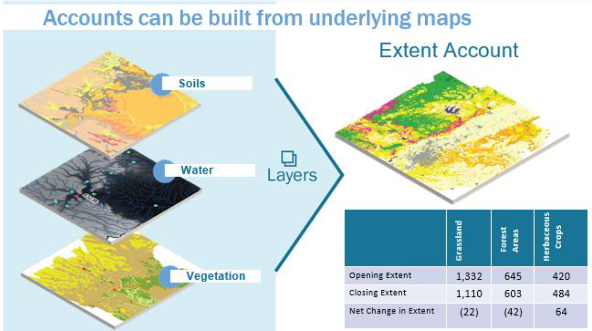
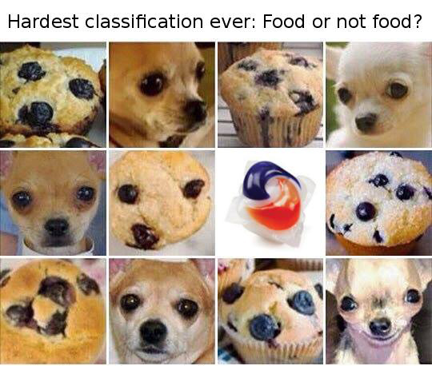

```{r setup, include=FALSE}
options(htmltools.dir.version = FALSE)
library(ggplot2)
library(plotly)
library(dplyr)
livedemosign <- function(top, left, deg) {
  htmltools::div("Live Demo!", class="faa-flash animated",
                 style=glue::glue("border:solid; border-color:black; position:absolute; top:{top}%; left:{left}%; font-size:36px; padding:4px; background-color:white; color:black;transform:rotate({deg}deg);")
                 )
}

```

```{r xaringan-animate-all, echo=FALSE}
# Set animation for all slides in the presentation 
xaringanExtra::use_animate_all("slide_left")
```

class: split-two white no-animation

.column.bg-main1[.content.vmiddle.left[
# Disclaimer

<br>

###I joined the SIAP on .orange[June 2020]! 

### I joined the UN on .orange[**June 2020**]!

### I have no working experience within an NSO

<br>

### > *The views expressed here are .orange[biased] by 20+ years of academic work!*


]]
.column.bg-main3[.content.vmiddle.center[
<center>

 

]]

???

Notes for slides on Disclaimer....

--

---

layout: false
class: bg-main3 split-30 hide-slide-number animated slideInRight fadeOutLeft
.column[

]
.column.slide-in-right[.content.vmiddle[
.sliderbox.shade_main.pad1[
.font5[Teaching?]
]
]]

---

class: split-two white no-animation

.column.bg-main1[.content.vmiddle.left[

# Teaching *vs* Training


<br>

### *Teaching*: to provide knowledge, instruction or information

<br>
### *Training*: to develop abilities through practice with instruction or supervision 

]]
.column.bg-main3[.content.vmiddle.center[


*The Open Science Training Handbook* [https://book.fosteropenscience.eu/en/]


]]
???

## Notes for slides on Teaching**
* SIAP do both
* this session is on training but... 


---
layout: false
class: bg-main3 split-30 hide-slide-number animated slideInRight fadeOutLeft
.column[

]
.column.slide-in-right[.content.vmiddle[
.sliderbox.shade_main.pad1[
.font5[Why Teaching Big Data?]
]
]]

---

class: middle center bg-main1 no-animation

# NSOs!

???
* With covid-19, NSOs had to adapt 
* Many NSOs had to provide **decision-making** data for gvts
* Some had to construct new **data-driven pipelines** for the public and **journalists** 

--

# NSOs have new needs
--

# NSOs have new data sources

--

# NSOs have new constraints and timelines

--

# NSOs **may** have the resources to access and use Big Data

--
# NSOs see in Big Data great opportunities but face challenges

---
class: top left no-animation
# There are Many .SiapCol[Challenges:]

##  .SiapCol[1- *Methodological* challenges:] 
### How to integrate non-traditional data into official statistics? 
### What are the sample biases and weights? 
### Which quality? What confidence?
### Legality of the approach? 

???
### Methodological challenges
Challenge of Merging various source into official Statistics
- The specificity is really **in the collection**
- So many **diverse data source** that many techniques have to be used and integrated
- **Generating process** of these data sources is unknown!
**What is the Gold standard of good quality of data for other data than Surveys** 

### Technical challenges
 - New techniques for acquisition(web scrapping, satellite map acquqition, mobiel phone positionning, electricity bills, scanner data, social media threads, networks  ) 
 - Data visualization tools and Dashboards
 - New tools (Python, R, Julia)
 - New methods Text analysis, predictive tools, 
 - Data science pipelines

### Human  challenges
* New skills 
* including **soft skills**
  * New partnerships and stakeholders

--

## .SiapCol[2-*Technical* challenges]
### How to access to the data?
### How to visualize and process the data (*Volume, Variety*)
### How to extend the coverage? (*Predictive tools*)
### How to reproduce/repeat the analysis

--
## .SiapCol[3- *Human* challenges] 
--

## .SiapCol[4- *Financial* challenges] 

---

layout: false
class: bg-main3 split-30 hide-slide-number animated slideInRight fadeOutLeft
.column[

]
.column.slide-in-right[.content.vmiddle[
.sliderbox.shade_main.pad1[
.font5[What Should we Teach?]
]
]]


---
class: split-two white no-animation

.column.bg-main1[.content[

<br>

# Many resources are already out there

<br>

## At the SIAP:

### .orange[Big Data] Course (with Kostat)

### .orange[Data Visualization] (with Paris2!)

### .orange[ICT] for Official Statistics

### Seminar on .orange[Statistical Capacity Building for New Data Sources] (2017)

]]

.column[.content.vmiddle.center[


<br>


##### [SIAP's NEW e-learning platform](https://siap-elearning.org/)

]]
???
- Statistics Korea regional training

---

class: split-two white no-animation

.column.bg-main1[.content[

<br>

# Many resources are already out there

<br>

## At the UN [Big Data GWG Marketplace](https://marketplace.officialstatistics.org/datasets)
## At the [UN-SDG:Learn](https://www.unsdglearn.org/microlearning/?_sf_s=big+data)

## At the [World Bank: Open Learning platform](https://olc.worldbank.org/search?search_api_views_fulltext=big&items_per_page=20&sort_by=field_course_weightage))
## At the Asian Development Bank
## [...]()

]]

.column[.content.vmiddle.center[

<table style="width:100%">
  <tr>
    <td></td>
    <td></td>
  </tr>
  <tr>
    <td></td>
    <td></td>
  </tr>
  <tr>
    <td></td> 
    <td></td>
  </tr>
  <tr>
    <td></td>
    <td></td>
  </tr>
</table>

]]

---
class: middle center bg-main1 no-animation
# So, which courses should we built? 


---
class: split-two white no-animation
.column.bg-main1[.content[

#  .right[Many courses should include..]

<br>


### *All courses on Official Statistics and SDGs*

<br>

### Gender Statisitics course 
#### Spatial Data Integration + predictive tools 
<br>

### System of Environmental-Economic Accounting
#### Satelite images integration (land recognition/evolution)
<br>

### Statistical Business Registers 
#### Webscrapping, text analysis

<br>
### Data Visualisation
#### Maps, Big Data Visualisation, Dashboards

<br>
### Metadata
#### Big Data Metadata

<br>
####  etc.
]]

.column[.content.vtop.center[

# .left[.SiapCol[..Big Data "chunks"!]]

 <br>


<br>

]]

---
class: top left bg-main1 no-animation
# So, which courses should we built? *A personal view*


???
* **Rq:** Soft skills are an important component (see Covid-19) 
  * how to negotiate a contract with a data provider?
  * How to disseminte/communicate? Etc 
  but I will  focus on Technical Skills.

* First , adapt **everything** to online teaching! (I willreturn to that in a minute!)
  * SIAP has been doing e-learning since 2013


* Obviously **New methods**  and here I talk of **Teaching** --> knowledge

We cannot affort to let people use software, black boxes, or programs without a **good understanding of the statistical fundations!!**

* Many New source have **spatial component**

--
 
## .orange[New methods]
--

### Spatial statistics 
--

### Predictive methods (ML, IA,...)
--

### Methods to adjust for selection biais
--

### Nonparametrics

--

### Big Data Visualization


--
## .orange[Practical training]
--

### Case studies: Cross fertilization using NSOs examples
--

### Statistical Workflows (Notebooks, *data-driven-documents*)
--

### Collaborative practices (GitLabs, GitHub, Cloud computing)


---
layout: false
class: bg-main3 split-30 hide-slide-number

.column[

]
.column.slide-in-right[.content.vmiddle[
.sliderbox.shade_main.pad1[
.font5[How to Teach?  (*online*)]
]
]]
---

# “Tell me and I forget, teach me and I may remember, involve me and I learn."
Xun Kuang (Chinese Confucian philosopher)


---

class: split-two white 

.column.bg-main1[.content[
<br>

# A simple prediction problem

### Consider the simulated dataset `Income`, which looks at the relationship between `Education` (years) and `Income` (thousands).

```{r}
data <- read.csv("data/Income.csv")
head(data)
```

### What shape is the relationship? Can we build a function to predict the value of a new data point?

]]

.column[.content.vmiddle.center[


```{r, fig.retina=4, echo=FALSE}
ggplot(data, aes(x=Education, y=Income))+geom_point(size=3, color="red")  + theme(text = element_text(size=20))
```


]]


---

class: middle center bg-main1

## Linear Regression to the Rescue!


---

class: pink-code

# .purple[What line is optimal?]

<br>

### We can use a .purple[**linear function**] to describe our data and .purple[**predict**] a new data point. The question is, what is the .purple[*optimal line*] ?

--

### One way to do this is find the slope and intercept that .purple[*minimise*] the sum of the squared residuals between the line and our data points:

<center>

</center>


### We can visualise this optimisation process using a .purple[**Shiny App**] [here](http://43.240.99.178:3838/sample-apps/LinearRegression/).

--

```{r}
knitr::knit_exit()
```


### .purple[`r icon::fa("r-project", size=1)`] performs this optimisation process for us when we call the `lm` function.

###### (PS) see an alternative derivation [here](https://sarahromanes.github.io/post/gganimate/)!
---

class: split-60 white

.column.bg-main1[.content[
# We can fit a linear model in `r icon::fa("r-project", size=1)` using the `lm` function as follows:

<br>

```{r, echo=F}
data <- read.csv("data/Income.csv")
```


```{r, eval=F}
fit <-  lm(data=data, #<<
            Income ~ Education)
```
]]
.column.bg-main3[.content.vmiddle.center[
# This tells the `lm` function what data we are referring to.
]]

---

class: split-60 white

.column.bg-main1[.content[
# We can fit a linear model in `r icon::fa("r-project", size=1)` using the `lm` function as follows:

<br>

```{r, eval=F}
fit <-  lm(data=data, 
            Income ~ Education) #<<
```
]]
.column.bg-main3[.content.vmiddle.center[
## This tells the `lm` function what variables we would like to regress. 

### R expects the relationship in the form of `response~predictors`. 
]]

---

class: split-60 white

.column.bg-main1[.content[
# We can fit a linear model in `r icon::fa("r-project", size=1)` using the `lm` function as follows:


```{r, eval=F}
fit <-  lm(data=data, 
            Income ~ Education)
summary(fit) #<<
```

```{r, eval=F}
Call:
lm(formula = Income ~ Education, data = data)

Residuals:
    Min      1Q  Median      3Q     Max 
-13.046  -2.293   0.472   3.288  10.110 

Coefficients:
            Estimate Std. Error t value Pr(>|t|)    
(Intercept) -39.4463     4.7248  -8.349  4.4e-09 *** #<<
Education     5.5995     0.2882  19.431  < 2e-16 ***
---
Signif. codes:  0 ‘***’ 0.001 ‘**’ 0.01 ‘*’ 0.05 ‘.’ 0.1 ‘ ’ 1

Residual standard error: 5.653 on 28 degrees of freedom
Multiple R-squared:  0.931,	Adjusted R-squared:  0.9285 
F-statistic: 377.6 on 1 and 28 DF,  p-value: < 2.2e-16
```


]]
.column.bg-main3[.content.vmiddle.center[

## We can use the `summary` function to examine regression coefficients, and information about the residuals of our model.
]]

---


class: split-60 white

.column.bg-main1[.content[
# We can fit a linear model in `r icon::fa("r-project", size=1)` using the `lm` function as follows:


```{r, eval=F}
fit <-  lm(data=data, 
            Income ~ Education)
summary(fit) #<<
```

```{r, eval=F}
Call:
lm(formula = Income ~ Education, data = data)

Residuals:
    Min      1Q  Median      3Q     Max 
-13.046  -2.293   0.472   3.288  10.110 

Coefficients:
            Estimate Std. Error t value Pr(>|t|)    
(Intercept) -39.4463     4.7248  -8.349  4.4e-09 *** 
Education     5.5995     0.2882  19.431  < 2e-16 *** #<<
---
Signif. codes:  0 ‘***’ 0.001 ‘**’ 0.01 ‘*’ 0.05 ‘.’ 0.1 ‘ ’ 1

Residual standard error: 5.653 on 28 degrees of freedom
Multiple R-squared:  0.931,	Adjusted R-squared:  0.9285 
F-statistic: 377.6 on 1 and 28 DF,  p-value: < 2.2e-16
```


]]
.column.bg-main3[.content.vmiddle.center[

## We can use the `summary` function to examine regression coefficients, and information about the residuals of our model.
]]

---


class: split-60 white

.column.bg-main1[.content[
# We can fit a linear model in `r icon::fa("r-project", size=1)` using the `lm` function as follows:


```{r, eval=T}
fit <-  lm(data=data, 
            Income ~ Education)

New_Data <-  data.frame(Education = c(15, 18))
predict(fit, New_Data) #<<
```

]]
.column.bg-main3[.content.vmiddle.center[

## Using the `predict` function, we can predict the `Income` of a new `Education` value (or values). 
]]

---

class: split-two white 

.column.bg-main1[.content[

<br>

# Modelling Binary Outcomes

<br>

### Consider the dataset `Spiders`, Suzuki et al. (2006) , from a study which looked at the relationship between `GrainSize` of sand and `Spiders` presence.

```{r}
data <- read.csv("data/Spiders.csv")
head(data,3)
```

### Can we use `lm` to predict the class for a new data point?

]]

.column[.content.vmiddle.center[


```{r, fig.retina=4, echo=FALSE}
ggplot(data, aes(x=GrainSize, y=Spiders))+geom_point(size=3, color="red")+ theme(text = element_text(size=20))
```


]]


---


class: split-two white

.column.bg-main1[.content[

<br>

## To model **binary data**, we need to .orange[link] our **predictors** to our response using a *link function*.

<br>

### Instead of predicting the outcome directly, we instead predict the probability of being class 1, given the linear combination of predictors, as follows:

$$ p(y=1|\\beta_0 + \\beta_1 x)  = \\sigma(\\beta_0 + \\beta_1 x) $$

For the logistic (`logit`) link

$$ p(y=1|\\beta_0 + \\beta_1 x)  = \\frac{1}{1+ \\exp( - (\\beta_0 + \\beta_1 x))} $$

For the probit (`probit`) link

$$ p(y=1|\\beta_0 + \\beta_1 x)  = \\Phi(\\beta_0 + \\beta_1 x) $$


]]
.column.white[.content.vmiddle.center[
```{r, echo=FALSE, fig.retina=4, warning=F, message=F}
x.vals <- rep(seq(-10,10, by=0.1),2)
fit.1 <- 1/(1+exp(-x.vals))
fit.2 <- pnorm(x.vals)
fit <- c(fit.1,fit.2)
Link <- c(rep("logistic", length(x.vals)),rep("probit", length(x.vals)))

library(latex2exp)

data <- data.frame(x=x.vals, y=fit, Link=Link)
ggplot(data, aes(x=x, y=y, color=Link))+geom_line(size=1.4) + xlab(TeX('$\\beta_0 + \\beta_1 x$')) +  ylab(TeX('$p(y=1|\\beta_0 + \\beta_1 x) = Link(\\beta_0 + \\beta_1 x)$')) + theme(text = element_text(size=20))
```

]]

---

class: split-60 white

.column.bg-main1[.content[
# We can fit a glm in `r icon::fa("r-project", size=1)` using the `glm` function as follows:

<br>


```{r, eval=F}
fit <-  glm(data=data, #<<
            Spiders~GrainSize,
            family=binomial(link="logit")) 
```
]]
.column.bg-main3[.content.vmiddle.center[
# This tells the `glm` function what data we are referring to.
]]

---

class: split-60 white

.column.bg-main1[.content[
# We can fit a glm in `r icon::fa("r-project", size=1)` using the `glm` function as follows:

<br>

```{r, eval=F}
fit <-  glm(data=data, 
            Spiders~GrainSize, #<<
            family=binomial(link="logit")) 
```
]]
.column.bg-main3[.content.vmiddle.center[
## This tells the `glm` function what variables we would like to regress. 
### Just like the `lm` function, R expects the relationship in the form of `response~predictors`. 
]]

---

class: split-60 white

.column.bg-main1[.content[
# We can fit a glm in `r icon::fa("r-project", size=1)` using the `glm` function as follows:

<br>

```{r, eval=F}
fit <-  glm(data=data, 
            Spiders~GrainSize, 
            family=binomial(link="logit")) #<<
```

<center>
  OR
</center>

```{r, eval=F}
fit <-  glm(data=data, 
            Spiders~GrainSize, 
            family=binomial(link="probit")) #<<
```


<center>
  OR
</center>

```{r, eval=F}
fit <-  glm(data=data, 
            Spiders~GrainSize, 
            family=binomial(link="cloglog")) #<<
```

<center>
  and more...
</center>

]]
.column.bg-main3[.content.vmiddle.center[
## This tells the `glm` function how we would like to model our response. For **binary** response data, we use the `binomial` family. 

## Further, there are many ways we can link our linear combination of predictors to the 0,1 space. 
]]

---

class: split-60 white

.column.bg-main1[.content[
# We can fit a glm in `r icon::fa("r-project", size=1)` using the `glm` function as follows:

<br>

```{r, eval=F}
fit <-  glm(data=data, 
            Spiders~GrainSize, 
            family=binomial(link="logit"))
summary(fit)
```
```{r, eval=F}
Call:
glm(formula = Spiders ~ GrainSize, family = binomial(link = "logit"), 
    data = data)

Deviance Residuals: 
    Min       1Q   Median       3Q      Max  
-1.7406  -1.0781   0.4837   0.9809   1.2582  

Coefficients:
            Estimate Std. Error z value Pr(>|z|)  
(Intercept)   -1.648      1.354  -1.217   0.2237  #<<
GrainSize      5.122      3.006   1.704   0.0884 . #<<
---
Signif. codes:  0 ‘***’ 0.001 ‘**’ 0.01 ‘*’ 0.05 ‘.’ 0.1 ‘ ’ 1

```
]]
.column.bg-main3[.content.vmiddle.center[
## Similar to the `lm` function, we can use the `summary` function to examine regression coefficients.
]]


---

class: split-60 white

.column.bg-main1[.content[
# We can fit a glm in `r icon::fa("r-project", size=1)` using the `glm` function as follows:

<br>

```{r, echo=F}
data <- read.csv("data/Spiders.csv")
```

```{r, eval=T}
fit <-  glm(data=data, 
            Spiders~GrainSize, 
            family=binomial(link="logit"))

New_Data <-  data.frame(GrainSize = c(0.4, 0.87))
probs <- predict(fit, New_Data,type="response") #<<
probs 
round(probs) #<<
```
]]
.column.bg-main3[.content.vmiddle.center[
## And we can also use the `predict` function to estimate class membership probability, as well as use the `round` command to estimate class.
]]


---

class: middle center bg-main1

## Of course, probabilities close to 0.5 are hard to classify!!


---

class: middle center bg-main1

`r anicon::faa('exclamation-triangle', animate='flash', size=7)`

# A warning for using GLMs!

---

class: split-two white

.column[.content[

```{r, fig.retina=4}
data.new <- read.csv("data/SpidersWarning.csv")
ggplot(data.new, 
       aes(x=GrainSize, y=Spiders)) +
       geom_point(col="red", size=3)
```
]]

.column.bg-main3[.content.vmiddle.center[
## Suppose the scientist who collected their data thought the study would look more convincing if the data was **perfectly** sepatated, and sneakily modified their results. How would their glm look?
]]

---

class: split-60 white

.column[.content[

<br>

```{r}
fit <-  glm(data=data.new, 
            Spiders~GrainSize, 
            family=binomial(link="logit"))
```


]]

.column.bg-main3[.content.vmiddle.center[
## Warnings appear when we try and fit this glm...
]]

---

class: split-60 white

.column[.content[

<br>

```{r, eval=T}
fit <-  glm(data=data.new, 
            Spiders~GrainSize, 
            family=binomial(link="logit"))
```
```{r, eval=F}
summary(fit) #<<
```
```{r, eval=FALSE}
Call:
glm(formula = Spiders ~ GrainSize, family = binomial(link = "logit"), 
    data = data.new)

Deviance Residuals: 
       Min          1Q      Median          3Q         Max  
-8.087e-05  -2.100e-08  -2.100e-08   2.100e-08   7.488e-05  

Coefficients:
            Estimate Std. Error z value Pr(>|z|)
(Intercept)   -912.4   362618.2  -0.003    0.998 #<<
GrainSize     1569.2   624478.6   0.003    0.998 #<<

```

]]

.column.bg-main3[.content.vmiddle.center[
## Warnings appear when we try and fit this glm...

## ...and, when we look at the `summary`, we can see our regression coefficients are blowing up, as well as the standard errors associated with them! 
]]


---

class: middle center bg-main1


---

class: split-two white 

.column.bg-main1[.content[

<br>

# Multiple Regression

<br>

### Can we fit a model with more than one predictor? Of course we can! Consider the dataset `Exam`, where two exam scores are given for each student, and a Label represents whether they passed or failed the course.

```{r, fig.retina=4}
data<- read.csv("data/Exam.csv", header=T)
head(data,4)
```

]]

.column[.content.vmiddle.center[


```{r, fig.retina=4, echo=FALSE}
ggplot(data, aes(x=Exam1, y=Exam2, color=factor(Label)))+geom_point(size=4) + theme(text = element_text(size=20))
```


]]


---

class: split-60 white

.column.bg-main1[.content[
# We can fit the glm in `r icon::fa("r-project", size=1)` using the `glm` function as follows:

<br>

```{r, eval=F}
fit <-  glm(data=data, 
            Label ~ ., #<<
            family=binomial(link="logit")) 
summary(fit)
```
```{r, eval=F}
Call:
glm(formula = Label ~ ., family = binomial(link = "logit"), 
    data = data)

Deviance Residuals: 
     Min        1Q    Median        3Q       Max  
-2.19287  -0.18009   0.01577   0.19578   1.78527  

Coefficients:
             Estimate Std. Error z value Pr(>|z|)    
(Intercept) -25.16133    5.79836  -4.339 1.43e-05 ***
Exam1         0.20623    0.04800   4.297 1.73e-05 ***
Exam2         0.20147    0.04862   4.144 3.42e-05 ***
---
Signif. codes:  0 ‘***’ 0.001 ‘**’ 0.01 ‘*’ 0.05 ‘.’ 0.1 ‘ ’ 1
```
]]
.column.bg-main3[.content.vmiddle.center[
### The formula `Label ~ . ` tells the `glm` function to regress against all (two) predictors, `Exam1` and `Exam2`.
]]

---

class: split-two white 

.column.bg-main1[.content[

<br>

# The Decision Boundary

<br>

### We can plot the **decision boundary** on our scatterplot for `Exam1` vs `Exam2` by looking at the set of points for which our classifier predicts $$p(y=1|\beta_0 + \beta_1 \text{Exam1} + \beta_2 \text{Exam2}) \geq 0.5$$


#### Given the `logit` link, this is true when 
$$\beta_0 + \beta_1 \text{Exam1} + \beta_2 \text{Exam2} \geq 0$$

#### This is the **decision boundary** and can be rearranged as 
$$ \text{Exam2} \geq \frac{-\beta_0}{\beta_2} + \frac{-\beta_1}{\beta_2} \text{Exam 1} $$

]]

.column[.content.vmiddle.center[


```{r, fig.retina=4, echo=FALSE}
fit <-  glm(data=data, 
            Label ~ ., #<<
            family=binomial(link="logit")) 
slope <- coef(fit)[2]/(-coef(fit)[3])
intercept <- coef(fit)[1]/(-coef(fit)[3])

ggplot(data, aes(x=Exam1, y=Exam2, color=factor(Label)))+geom_point(size=4) + theme(text = element_text(size=20)) + geom_abline(slope=slope, intercept=intercept)
```


]]


---


layout: false
class: bg-main3 split-30 hide-slide-number

.column[

]
.column.slide-in-right[.content.vmiddle[
.sliderbox.shade_main.pad1[
.font5[Classification]
]
]]

---

class: middle center bg-main1



---


class: split-two white 

.column.bg-main1[.content[

<br>

# When we can't use GLMs

<br>

### Consider the dataset `Microchips`, containing test scores `Test1` and `Test2`, and `Label` indicating whether or not the chip passed the test.

```{r, fig.retina=4}
data <- read.csv("data/Microchips.csv")
head(data,4)
```


### Why can't we use `glm` to predict the class for a new data point?
]]

.column[.content.vmiddle.center[


```{r, fig.retina=4, echo=FALSE}
ggplot(data, aes(x=Test1, y=Test2, color=factor(Label)))+geom_point(size=4) + theme(text = element_text(size=20))
```


]]

---

# .purple[Different data types require different machine learning methods]

<br>

## While we can indeed use Logistic regression to .purple[**classify**] data points, this simply isn't feasible when:

### - We have high class seperation in our data
### - We have a non-linear combination of predictors influcing our response (as in this case)

<br>

## .purple[**So, what other options do we have?**]

---
class: middle center bg-main1
# Leftovers
# There *are* Many .orange[Opportunities]
* Easier  access  to data, an in real time 
	- Electricity to monitor people in house (Denmark)
	- Phone mobility
* NSOs proved they are very capable to provide insights for policy makers
* NSOs proved they are the **trusted** source of information


---

class: middle center bg-main1
# *All Knwowledge is an answer to a question*
### Gaston Bachelard (french philosopher) 
---