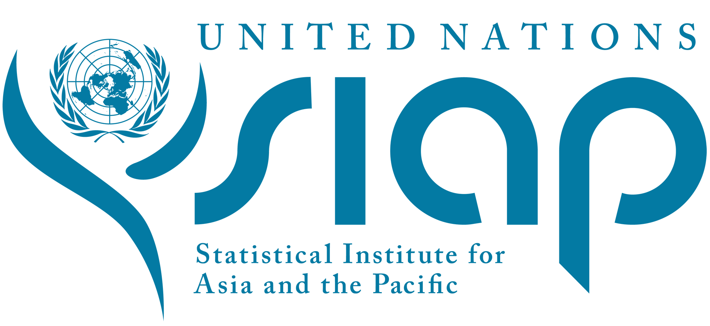
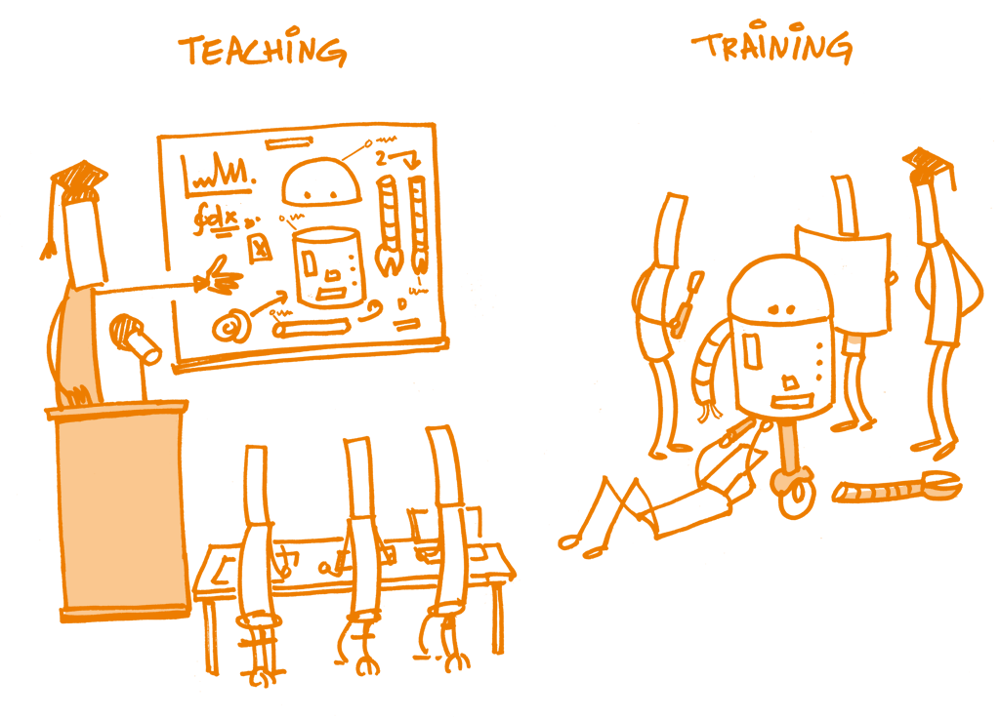
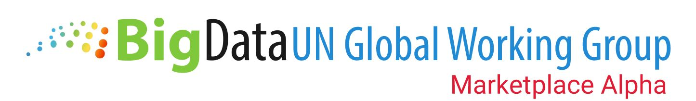
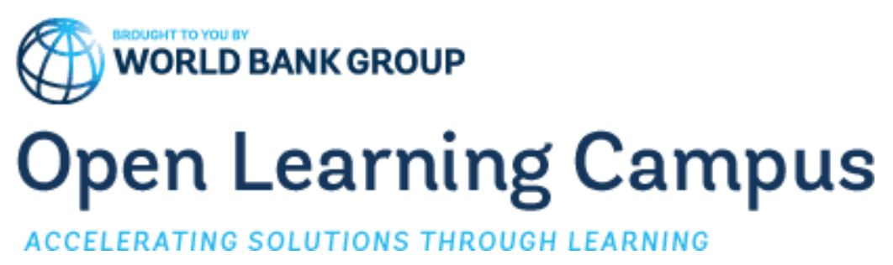
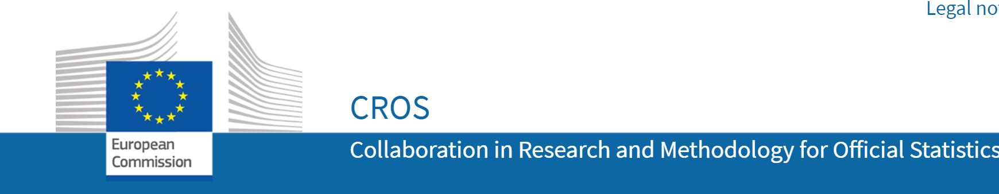

```{r setup, include=FALSE}
options(htmltools.dir.version = FALSE)
library(ggplot2)
library(plotly)
library(dplyr)
livedemosign <- function(top, left, deg) {
  htmltools::div("Live Demo!", class="faa-flash animated",
                 style=glue::glue("border:solid; border-color:black; position:absolute; top:{top}%; left:{left}%; font-size:36px; padding:4px; background-color:white; color:black;transform:rotate({deg}deg);")
                 )
}

```

```{r xaringan-animate-all, echo=FALSE}
# Set animation for all slides in the presentation 
xaringanExtra::use_animate_all("slide_left")
```

class: split-two white no-animation

.column.bg-main1[.content.vmiddle.left[
# Disclaimer

<br>

###I joined the SIAP on .orange[June 2020]! 

### I joined the UN on .orange[**June 2020**]!

### I have no working experience within an NSO

<br>

### > *The views expressed here are .orange[biased] by 20+ years of academic work!*


]]
.column.bg-main3[.content.vmiddle.center[
<center>

 

]]

???
Good afternoon,
* I would like to thank  **Dominik Rozkrut** for chairing this session and **Ralf Becker** for the invitation. 

* My name is Christophe Bontemps, I work at the Statistical Institue for Asia and the pacific. 


--

---

layout: false
class: bg-main3 split-30 hide-slide-number animated slideInRight fadeOutLeft
.column[

]
.column.slide-in-right[.content.vmiddle[
.sliderbox.shade_main.pad1[
.font5[Teaching?]
]
]]

---

class: split-two white no-animation

.column.bg-main1[.content.vmiddle.left[

# .orange[Big Data]

# Teaching *vs* Training


<br>

### .orange[Teaching]: to provide knowledge, instruction or information

<br>
### .orange[Training]: to develop abilities through practice with instruction or supervision 

]]
.column.bg-main3[.content.vmiddle.center[


*The Open Science Training Handbook* [https://book.fosteropenscience.eu/en/]


]]
???
## My presentation is intitled "Teaching Big Data" with a ?

### **Big Data** here is a shortcut for **New Data Sources and Big Data**

###  "Teaching" with a ? 
* Difference between the two...
* Of course, even on a  "Training" course,  we do "teach" 
* At the SIAP, courses include both training and teaching
* *I'll come back to that later* 


---
layout: false
class: bg-main3 split-30 hide-slide-number animated slideInRight fadeOutLeft
.column[

]
.column.slide-in-right[.content.vmiddle[
.sliderbox.shade_main.pad1[
.font5[Why Teaching Big Data? ]
]
]]

---

class: middle center bg-main1 no-animation

# NSOs!

???
* With covid-19, NSOs had to **adapt** 
* Many NSOs had to provide **decision-making** data for gvts, responsible for **data dissemination** --> data literacy
* Some had to construct new **data-driven pipelines** for politicians, the public and **journalists** 
* **Collecting** Big Data is important to **complement** official or adminstrative data (integration ia difficult), but this collection is **necessary** and **critical** when it comes to emmergency decisions  (such as during Covid-19 or during disasters)

--

# NSOs have .orange[new needs]
--

# NSOs have now new missions

--

# NSOs have new constraints and timelines

--

# NSOs **may** have the resources to access and use Big Data

--
# NSOs see in Big Data great opportunities but face .orange[**challenges!**]

---

layout: false
class: bg-main3 split-30 hide-slide-number animated slideInRight fadeOutLeft
.column[

]
.column.slide-in-right[.content.vmiddle[
.sliderbox.shade_main.pad1[
.font5[How can *We* Help? ]
]
]]


---
class: split-two white no-animation

.column.bg-main1[.content[

<br>

# Many courses .orange[at the SIAP:]
###.font_cool[include .orange[GIS],.orange[scanner data], .orange[webscrapping], .orange[text mining], .orange[R], .orange[python]  .orange[...]]

<br>

### - .orange[**Big Data**] Course .font_cool[(with Kostat), since 2016]

### - Innovations in Use of .orange[**New Data Sources**] and Methodologies for SDG .font_cool[(2019)]

### - .orange[**ICT**] Innovations for Modernizing Official Statistical Systems .font_cool[(2017), with JICA)]

### - .orange[**Data Visualization**] .font_cool[(with Paris2!)]

### - Seminar on Statistical Capacity Building for .orange[**New Data Sources**] .font_cool[(2017)]

<br>

### and .orange[more] to come also on our [new LMS](https://siap-elearning.org/) ...

]]

.column[.content.vmiddle.center[


<br>


##### [SIAP's NEW e-learning platform](https://siap-elearning.org/)

]]
???
Many course at SIAP for quite some time now

- Include the **Data scientist** toolbox on different typ of Data (GIS, Scanner, text,... )
- Big Data course with Statistics Korea (regional training)
- We had a more general course on **ICT Innovations for Modernizing Official Statistical Systems**with people from the **WorldBank**
- includes Big Data (with Python); GIS (Qgis);  webscrapping 

**NOW** We will adapt these materials for online courses thanks to our **new LMS**

---
class: split-two white no-animation

.column.bg-main1[.content[

<br>

# Many .orange[online] resources :

<br>

## At the UN [Big Data GWG Marketplace](https://marketplace.officialstatistics.org/datasets)
## At the [UN-SDG:Learn](https://www.unsdglearn.org/microlearning/?_sf_s=big+data)

## At the [World Bank](https://olc.worldbank.org/search?search_api_views_fulltext=big&items_per_page=20&sort_by=field_course_weightage): Open Learning

## At [Eurostat](https://ec.europa.eu/eurostat/cros/content/estp-training-courses_en) 

## At [FAO](http://www.fao.org/home/digital-reports/en/).orange[...]

# .orange[+] 
## All .orange[MOOCs] platform, tutorials, .orange[online] universities,...
## [...]()

]]

.column[.content.vmiddle.center[

<table style="width:100%">
  <tr>
    <td></td>
    <td></td>
  </tr>
  <tr>
    <td></td>
    <td></td>
  </tr>
  <tr>
    <td></td> 
    <td></td>
  </tr>
  <tr>
    <td></td>
    <td></td>
  </tr>
</table>

]]
???
- We will adapt our courses **online**

- UN Global platform and marketplace as well asRegional Hubs 

- Training Resources in many places, World Bank, Eurostat, FAO 

--

---

layout: false
class: bg-main3 split-30 hide-slide-number animated slideInRight fadeOutLeft
.column[

]
.column.slide-in-right[.content.vmiddle[
.sliderbox.shade_main.pad1[
.font5[What Should we Focus On? ]
]
]]


---
class: split-two white no-animation
.column.bg-main1[.content[

#  .right[Many courses include..]

<br>

### *All courses on Official Statistics and SDGs*

<br>

### Course Gender Statistics (UNSD & UNWOMEN) 
#### .orange[Satellite Data] Integration + .orange[predictive analysis] 


### System of Environmental-Economic Accounting
#### .orange[Satellite images] integration, .orange[land recognition] 


### Statistical Business Registers 
#### .orange[Web-scrapping], .orange[text analysis]


### Data Visualization
#### .orange[Maps], Big Data Visualization, .orange[Dashboards]


### Metadata
#### .orange[Big Data Metadata]


####  etc.
]]

.column[.content.vtop.center[

# .left[.SiapCol[..Big Data "chunks"!]]

 <br>


<br>

]]

???
* Many course already Big Data Chuks
* We probably  **need** to **Adjust** courses to integrate big Data
--
---
class: top left bg-main1 no-animation

# .center[So, what should we .orange[focus] on?]
### .center[(*A personal view*)]


???
* **Rq1:**: **Soft skills** are an important component (see Covid-19) 
  * how to negotiate a contract with a data provider?
  * How to disseminate/communicate? Etc 
  but I will manly focus on Statistics
  
**Rq2:**: Member of the UN Task Team on Skills, Training and Capacity Development, I will not talk on behalf of this group  see later by **Ceri**


--
 
## .orange[New methods]

???
* First , adapt **everything** to online teaching! (I will return to that in a minute!)
  * **SIAP has been doing e-learning since 2013**


* Obviously **New methods**  and here I talk of **Teaching** --> knowledge

> We cannot afford to let people use software, black boxes, or programs without a > **good understanding of the statistical foundations!!**

#### Methods
* Integration is tricky, biaises, trust --> quality data
* Statistical learning to avoid "black box" statistics: **Big Data literacy**
* Many New source have **spatial component**, not easy to disaggrate or aggregate spatialy 
* Decision-based statistics are visual (Covid-19), how do people/politicians understand that? 


--


### Data integration .font_cool[(*Adjusting for selection bias, coverage*, ...)]

--

### Statistical Learning (ML, AI,...) .font_cool[(*Big Data literacy*)]

--

### Spatial Statistics  .font_cool[(Spatial aggregation/disaggregation)]

--

### Big Data Visualization .font_cool[(*Visual literacy*)]

### .orange[...]

--
## .right[ .orange[Practical training]]

--
### .right[Data Gathering .font_cool[(*satellite data, webscrapping, mobile phone*,... )]]

--
### .right[Ethics/legal issues .font_cool[(*Data dissemination, Bias in AI*,...)]]

--

### .right[Statistical Workflows .font_cool[(*Notebooks, data-driven-documents*)]]
--

### .right[Collaborative practices .font_cool[(*GitLabs, GitHub, Cloud computing*)]]

--


---
layout: false
class: bg-main3 split-30 hide-slide-number

.column[

]
.column.slide-in-right[.content.vmiddle[
.sliderbox.shade_main.pad1[
.font5[How to Teach?  (*online*)]
]
]]

---
class: top left bg-main1 no-animation

# .center[.orange[Variety] is key!]

???
There is a discussion/ reflection on how to improve our e-courses (**New LMS**)

**no one-size-fits-all** solution!

* *Micro learning* : Example: Sometimes, we don't need to follow a 4 week course to apply web-scrapping or  text analysis or draw a map..
* Can be nice assets and a **self-paced** way of learning

* *Social learning* We have tons of very good examples from NSOs themselves
  - We already introduced Webinars
  - Involve the learners with case studies
  - Make learners work in groups (**YES**, this is possible online)
  - Have online discussions (not at the end of the course)
  
* Engagement: Split course in phases 1- we train, 2- Learners apply 3- They show/explain  4 (optional) - we evaluate! 
* Games (already did that with Kahoot)
* Contest: There is an ongoing Hackathon on Marine Traffic (AIS Data)

--


## .orange[Micro]-learning
### (short self-paced learning)

--

## .right[.orange[Social] learning]
### .right[(cross-fertilization)]

--

## Learning-.orange[by-doing]
### (Engage learners into action)


--

## .right[.orange[Collaborative] learning]
### .right[(Introduce case studies/ peer reviews / Team work)]

--
### .SiapCol[;-)]

# .center[.orange[Innovative] learning]
### .center[(Games? Live coding? Contests? Simulations?...)]


---
class: top left bg-main3 no-animation

# .center[Final .orange[Thoughts]]

<br>
 
## .orange[Big Data] training:

--
### - Involve .orange[many different] subjects, diciplines, type of data, (national/ regional) contexts

--

### - Resemble to .orange[*data science*] training
--

### -  Needs .orange[coordination] and .orange[cooperation] between course providers (including Academics)

--

### -  Should .orange[use NSOs examples] (Covid-19) as cases studies / practical trainings

--

### -  Needs .orange[online courses] as well as face-to-face

--

<br>
<center>  </center>

### .center[SIAP's  [e-learning platform](https://siap-elearning.org/)]

---
class: top center bg-main1 no-animation


