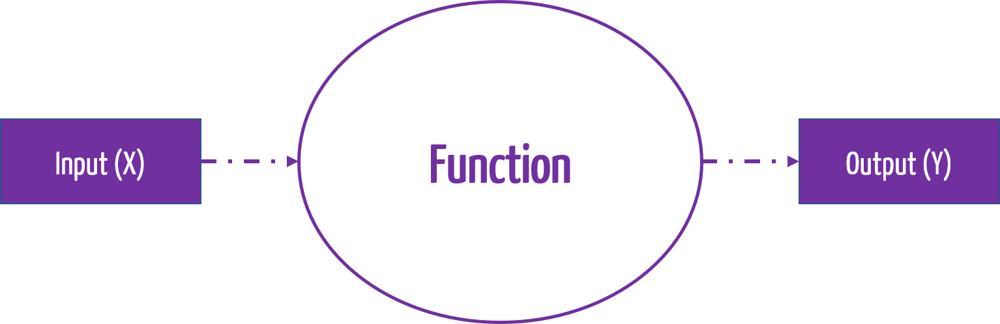
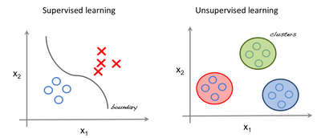
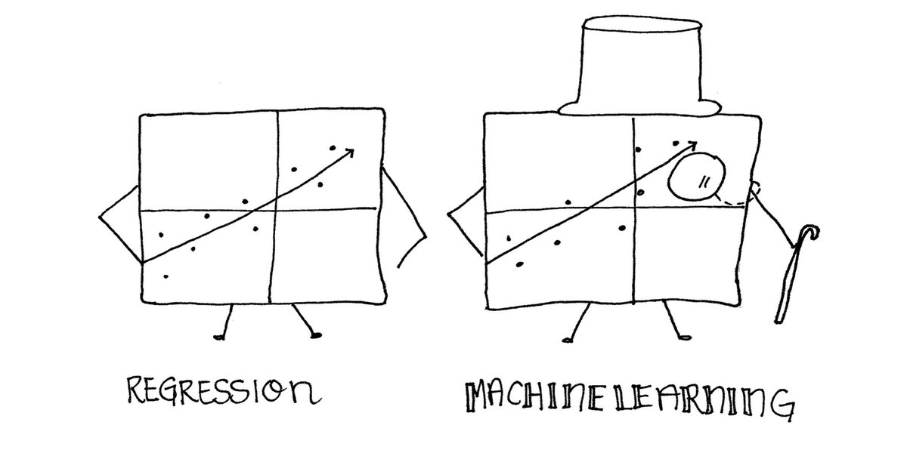
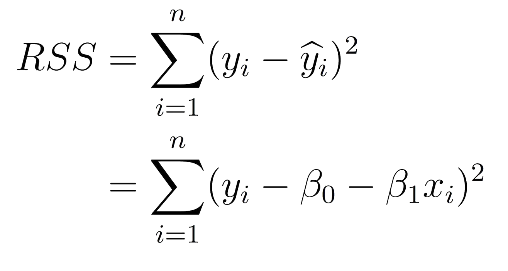
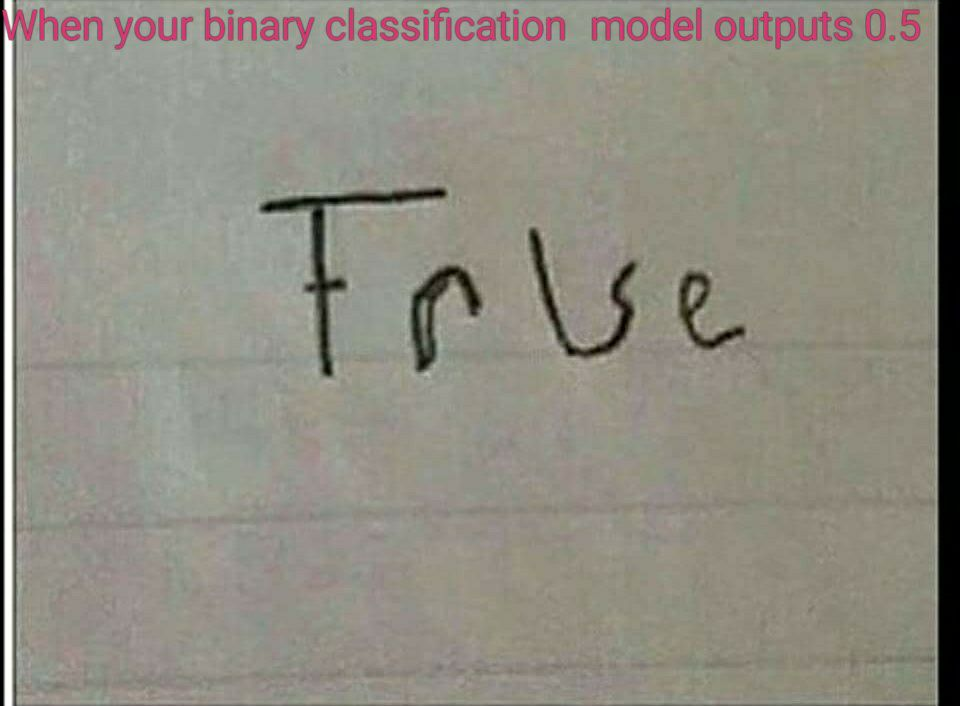
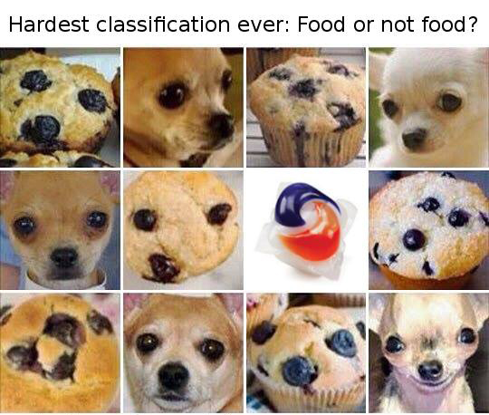

```{r setup, include=FALSE}
options(htmltools.dir.version = FALSE)
library(ggplot2)
library(plotly)
library(dplyr)
livedemosign <- function(top, left, deg) {
  htmltools::div("Live Demo!", class="faa-flash animated",
                 style=glue::glue("border:solid; border-color:black; position:absolute; top:{top}%; left:{left}%; font-size:36px; padding:4px; background-color:white; color:black;transform:rotate({deg}deg);")
                 )
}

```

class: split-two white

.column.bg-main1[.content.vmiddle.left[

# Disclaimer

<br>

###I joined the SIAP on .orange[June 2020]! 

### I joined the UN on .orange[**June 2020**]!

### I have no working experience within an NSO

<br>

### > The views expressed here are biased by 20+ years of academic work!


]]
.column.bg-main3[.content.vmiddle.center[
<center>

 

]]


---


layout: false
class: bg-main3 split-30 hide-slide-number

.column[

]
.column.slide-in-right[.content.vmiddle[
.sliderbox.shade_main.pad1[
.font5[Teaching?]
]
]]

---

class: split-two white

.column.bg-main1[.content.vmiddle.center[

# Teaching *vs* Training

<br>

### This two part R-Ladies workshop is designed to give you a small taster into the large field that is known as .orange[**Machine Learning**]! Today, we will cover supervised learning techniques (explained later), and next week we will cover model performance assessment.

<br>


]]
.column.bg-main3[.content.vmiddle.center[
<center>
 

]]


---

class: middle center bg-main1


---

# .purple[What *is* Machine Learning?]

<br>

### Machine learning is concerned with finding functions $Y=f(X)+\epsilon$ that best **predict** outputs (responses), given data inputs (predictors).

<br>

<center>

  

</center>

<br>

### Mathematically, Machine Learning problems are simply *optimisation* problems, in which we will use .purple[`r icon::fa("r-project", size=1)`] to help us solve!

---

# .purple[Why do Machine Learning in `r icon::fa("r-project", size=1)`?]

<br>

<center>

  

</center>

---

class: split-two white 

.column.bg-main1[.content[

<br>

# Types of Learning

<br>

## .orange[Supervised Learning]

### - We have knowledge of class labels or values.

### - Goal: train a model using known class labels to predict class or value label for a new data point.


## .orange[Unsupervised Learning]

### - No knowledge of output class or value –data is unlabelled.

### - Goal: determine data patterns/groupings.


]]

.column[.content.vmiddle.center[



##### .purple[Credit to Towards Data Science]

]]


---

layout: false
class: bg-main3 split-30 hide-slide-number

.column[

]
.column.slide-in-right[.content.vmiddle[
.sliderbox.shade_main.pad1[
.font5[Regression]
]
]]

---

class: split-two white 

.column.bg-main1[.content[
<br>

# A simple prediction problem

### Consider the simulated dataset `Income`, which looks at the relationship between `Education` (years) and `Income` (thousands).

```{r}
data <- read.csv("data/Income.csv")
head(data)
```

### What shape is the relationship? Can we build a function to predict the value of a new data point?

]]

.column[.content.vmiddle.center[


```{r, fig.retina=4, echo=FALSE}
ggplot(data, aes(x=Education, y=Income))+geom_point(size=3, color="red")  + theme(text = element_text(size=20))
```


]]


---

class: middle center bg-main1

## Linear Regression to the Rescue!



---

class: pink-code

# .purple[What line is optimal?]

<br>

### We can use a .purple[**linear function**] to describe our data and .purple[**predict**] a new data point. The question is, what is the .purple[*optimal line*] ?

--

### One way to do this is find the slope and intercept that .purple[*minimise*] the sum of the squared residuals between the line and our data points:

<center>

</center>


### We can visualise this optimisation process using a .purple[**Shiny App**] [here](http://43.240.99.178:3838/sample-apps/LinearRegression/).

--

```{r}
knitr::knit_exit()
```


### .purple[`r icon::fa("r-project", size=1)`] performs this optimisation process for us when we call the `lm` function.

###### (PS) see an alternative derivation [here](https://sarahromanes.github.io/post/gganimate/)!
---

class: split-60 white

.column.bg-main1[.content[
# We can fit a linear model in `r icon::fa("r-project", size=1)` using the `lm` function as follows:

<br>

```{r, echo=F}
data <- read.csv("data/Income.csv")
```


```{r, eval=F}
fit <-  lm(data=data, #<<
            Income ~ Education)
```
]]
.column.bg-main3[.content.vmiddle.center[
# This tells the `lm` function what data we are referring to.
]]

---

class: split-60 white

.column.bg-main1[.content[
# We can fit a linear model in `r icon::fa("r-project", size=1)` using the `lm` function as follows:

<br>

```{r, eval=F}
fit <-  lm(data=data, 
            Income ~ Education) #<<
```
]]
.column.bg-main3[.content.vmiddle.center[
## This tells the `lm` function what variables we would like to regress. 

### R expects the relationship in the form of `response~predictors`. 
]]

---

class: split-60 white

.column.bg-main1[.content[
# We can fit a linear model in `r icon::fa("r-project", size=1)` using the `lm` function as follows:


```{r, eval=F}
fit <-  lm(data=data, 
            Income ~ Education)
summary(fit) #<<
```

```{r, eval=F}
Call:
lm(formula = Income ~ Education, data = data)

Residuals:
    Min      1Q  Median      3Q     Max 
-13.046  -2.293   0.472   3.288  10.110 

Coefficients:
            Estimate Std. Error t value Pr(>|t|)    
(Intercept) -39.4463     4.7248  -8.349  4.4e-09 *** #<<
Education     5.5995     0.2882  19.431  < 2e-16 ***
---
Signif. codes:  0 ‘***’ 0.001 ‘**’ 0.01 ‘*’ 0.05 ‘.’ 0.1 ‘ ’ 1

Residual standard error: 5.653 on 28 degrees of freedom
Multiple R-squared:  0.931,	Adjusted R-squared:  0.9285 
F-statistic: 377.6 on 1 and 28 DF,  p-value: < 2.2e-16
```


]]
.column.bg-main3[.content.vmiddle.center[

## We can use the `summary` function to examine regression coefficients, and information about the residuals of our model.
]]

---


class: split-60 white

.column.bg-main1[.content[
# We can fit a linear model in `r icon::fa("r-project", size=1)` using the `lm` function as follows:


```{r, eval=F}
fit <-  lm(data=data, 
            Income ~ Education)
summary(fit) #<<
```

```{r, eval=F}
Call:
lm(formula = Income ~ Education, data = data)

Residuals:
    Min      1Q  Median      3Q     Max 
-13.046  -2.293   0.472   3.288  10.110 

Coefficients:
            Estimate Std. Error t value Pr(>|t|)    
(Intercept) -39.4463     4.7248  -8.349  4.4e-09 *** 
Education     5.5995     0.2882  19.431  < 2e-16 *** #<<
---
Signif. codes:  0 ‘***’ 0.001 ‘**’ 0.01 ‘*’ 0.05 ‘.’ 0.1 ‘ ’ 1

Residual standard error: 5.653 on 28 degrees of freedom
Multiple R-squared:  0.931,	Adjusted R-squared:  0.9285 
F-statistic: 377.6 on 1 and 28 DF,  p-value: < 2.2e-16
```


]]
.column.bg-main3[.content.vmiddle.center[

## We can use the `summary` function to examine regression coefficients, and information about the residuals of our model.
]]

---


class: split-60 white

.column.bg-main1[.content[
# We can fit a linear model in `r icon::fa("r-project", size=1)` using the `lm` function as follows:


```{r, eval=T}
fit <-  lm(data=data, 
            Income ~ Education)

New_Data <-  data.frame(Education = c(15, 18))
predict(fit, New_Data) #<<
```

]]
.column.bg-main3[.content.vmiddle.center[

## Using the `predict` function, we can predict the `Income` of a new `Education` value (or values). 
]]

---

class: split-two white 

.column.bg-main1[.content[

<br>

# Modelling Binary Outcomes

<br>

### Consider the dataset `Spiders`, Suzuki et al. (2006) , from a study which looked at the relationship between `GrainSize` of sand and `Spiders` presence.

```{r}
data <- read.csv("data/Spiders.csv")
head(data,3)
```

### Can we use `lm` to predict the class for a new data point?

]]

.column[.content.vmiddle.center[


```{r, fig.retina=4, echo=FALSE}
ggplot(data, aes(x=GrainSize, y=Spiders))+geom_point(size=3, color="red")+ theme(text = element_text(size=20))
```


]]


---


class: split-two white

.column.bg-main1[.content[

<br>

## To model **binary data**, we need to .orange[link] our **predictors** to our response using a *link function*.

<br>

### Instead of predicting the outcome directly, we instead predict the probability of being class 1, given the linear combination of predictors, as follows:

$$ p(y=1|\\beta_0 + \\beta_1 x)  = \\sigma(\\beta_0 + \\beta_1 x) $$

For the logistic (`logit`) link

$$ p(y=1|\\beta_0 + \\beta_1 x)  = \\frac{1}{1+ \\exp( - (\\beta_0 + \\beta_1 x))} $$

For the probit (`probit`) link

$$ p(y=1|\\beta_0 + \\beta_1 x)  = \\Phi(\\beta_0 + \\beta_1 x) $$


]]
.column.white[.content.vmiddle.center[
```{r, echo=FALSE, fig.retina=4, warning=F, message=F}
x.vals <- rep(seq(-10,10, by=0.1),2)
fit.1 <- 1/(1+exp(-x.vals))
fit.2 <- pnorm(x.vals)
fit <- c(fit.1,fit.2)
Link <- c(rep("logistic", length(x.vals)),rep("probit", length(x.vals)))

library(latex2exp)

data <- data.frame(x=x.vals, y=fit, Link=Link)
ggplot(data, aes(x=x, y=y, color=Link))+geom_line(size=1.4) + xlab(TeX('$\\beta_0 + \\beta_1 x$')) +  ylab(TeX('$p(y=1|\\beta_0 + \\beta_1 x) = Link(\\beta_0 + \\beta_1 x)$')) + theme(text = element_text(size=20))
```

]]

---

class: split-60 white

.column.bg-main1[.content[
# We can fit a glm in `r icon::fa("r-project", size=1)` using the `glm` function as follows:

<br>


```{r, eval=F}
fit <-  glm(data=data, #<<
            Spiders~GrainSize,
            family=binomial(link="logit")) 
```
]]
.column.bg-main3[.content.vmiddle.center[
# This tells the `glm` function what data we are referring to.
]]

---

class: split-60 white

.column.bg-main1[.content[
# We can fit a glm in `r icon::fa("r-project", size=1)` using the `glm` function as follows:

<br>

```{r, eval=F}
fit <-  glm(data=data, 
            Spiders~GrainSize, #<<
            family=binomial(link="logit")) 
```
]]
.column.bg-main3[.content.vmiddle.center[
## This tells the `glm` function what variables we would like to regress. 
### Just like the `lm` function, R expects the relationship in the form of `response~predictors`. 
]]

---

class: split-60 white

.column.bg-main1[.content[
# We can fit a glm in `r icon::fa("r-project", size=1)` using the `glm` function as follows:

<br>

```{r, eval=F}
fit <-  glm(data=data, 
            Spiders~GrainSize, 
            family=binomial(link="logit")) #<<
```

<center>
  OR
</center>

```{r, eval=F}
fit <-  glm(data=data, 
            Spiders~GrainSize, 
            family=binomial(link="probit")) #<<
```


<center>
  OR
</center>

```{r, eval=F}
fit <-  glm(data=data, 
            Spiders~GrainSize, 
            family=binomial(link="cloglog")) #<<
```

<center>
  and more...
</center>

]]
.column.bg-main3[.content.vmiddle.center[
## This tells the `glm` function how we would like to model our response. For **binary** response data, we use the `binomial` family. 

## Further, there are many ways we can link our linear combination of predictors to the 0,1 space. 
]]

---

class: split-60 white

.column.bg-main1[.content[
# We can fit a glm in `r icon::fa("r-project", size=1)` using the `glm` function as follows:

<br>

```{r, eval=F}
fit <-  glm(data=data, 
            Spiders~GrainSize, 
            family=binomial(link="logit"))
summary(fit)
```
```{r, eval=F}
Call:
glm(formula = Spiders ~ GrainSize, family = binomial(link = "logit"), 
    data = data)

Deviance Residuals: 
    Min       1Q   Median       3Q      Max  
-1.7406  -1.0781   0.4837   0.9809   1.2582  

Coefficients:
            Estimate Std. Error z value Pr(>|z|)  
(Intercept)   -1.648      1.354  -1.217   0.2237  #<<
GrainSize      5.122      3.006   1.704   0.0884 . #<<
---
Signif. codes:  0 ‘***’ 0.001 ‘**’ 0.01 ‘*’ 0.05 ‘.’ 0.1 ‘ ’ 1

```
]]
.column.bg-main3[.content.vmiddle.center[
## Similar to the `lm` function, we can use the `summary` function to examine regression coefficients.
]]


---

class: split-60 white

.column.bg-main1[.content[
# We can fit a glm in `r icon::fa("r-project", size=1)` using the `glm` function as follows:

<br>

```{r, echo=F}
data <- read.csv("data/Spiders.csv")
```

```{r, eval=T}
fit <-  glm(data=data, 
            Spiders~GrainSize, 
            family=binomial(link="logit"))

New_Data <-  data.frame(GrainSize = c(0.4, 0.87))
probs <- predict(fit, New_Data,type="response") #<<
probs 
round(probs) #<<
```
]]
.column.bg-main3[.content.vmiddle.center[
## And we can also use the `predict` function to estimate class membership probability, as well as use the `round` command to estimate class.
]]


---

class: middle center bg-main1

## Of course, probabilities close to 0.5 are hard to classify!!



---

class: middle center bg-main1

`r anicon::faa('exclamation-triangle', animate='flash', size=7)`

# A warning for using GLMs!

---

class: split-two white

.column[.content[

```{r, fig.retina=4}
data.new <- read.csv("data/SpidersWarning.csv")
ggplot(data.new, 
       aes(x=GrainSize, y=Spiders)) +
       geom_point(col="red", size=3)
```
]]

.column.bg-main3[.content.vmiddle.center[
## Suppose the scientist who collected their data thought the study would look more convincing if the data was **perfectly** sepatated, and sneakily modified their results. How would their glm look?
]]

---

class: split-60 white

.column[.content[

<br>

```{r}
fit <-  glm(data=data.new, 
            Spiders~GrainSize, 
            family=binomial(link="logit"))
```


]]

.column.bg-main3[.content.vmiddle.center[
## Warnings appear when we try and fit this glm...
]]

---

class: split-60 white

.column[.content[

<br>

```{r, eval=T}
fit <-  glm(data=data.new, 
            Spiders~GrainSize, 
            family=binomial(link="logit"))
```
```{r, eval=F}
summary(fit) #<<
```
```{r, eval=FALSE}
Call:
glm(formula = Spiders ~ GrainSize, family = binomial(link = "logit"), 
    data = data.new)

Deviance Residuals: 
       Min          1Q      Median          3Q         Max  
-8.087e-05  -2.100e-08  -2.100e-08   2.100e-08   7.488e-05  

Coefficients:
            Estimate Std. Error z value Pr(>|z|)
(Intercept)   -912.4   362618.2  -0.003    0.998 #<<
GrainSize     1569.2   624478.6   0.003    0.998 #<<

```

]]

.column.bg-main3[.content.vmiddle.center[
## Warnings appear when we try and fit this glm...

## ...and, when we look at the `summary`, we can see our regression coefficients are blowing up, as well as the standard errors associated with them! 
]]


---

class: middle center bg-main1


---

class: split-two white 

.column.bg-main1[.content[

<br>

# Multiple Regression

<br>

### Can we fit a model with more than one predictor? Of course we can! Consider the dataset `Exam`, where two exam scores are given for each student, and a Label represents whether they passed or failed the course.

```{r, fig.retina=4}
data<- read.csv("data/Exam.csv", header=T)
head(data,4)
```

]]

.column[.content.vmiddle.center[


```{r, fig.retina=4, echo=FALSE}
ggplot(data, aes(x=Exam1, y=Exam2, color=factor(Label)))+geom_point(size=4) + theme(text = element_text(size=20))
```


]]


---

class: split-60 white

.column.bg-main1[.content[
# We can fit the glm in `r icon::fa("r-project", size=1)` using the `glm` function as follows:

<br>

```{r, eval=F}
fit <-  glm(data=data, 
            Label ~ ., #<<
            family=binomial(link="logit")) 
summary(fit)
```
```{r, eval=F}
Call:
glm(formula = Label ~ ., family = binomial(link = "logit"), 
    data = data)

Deviance Residuals: 
     Min        1Q    Median        3Q       Max  
-2.19287  -0.18009   0.01577   0.19578   1.78527  

Coefficients:
             Estimate Std. Error z value Pr(>|z|)    
(Intercept) -25.16133    5.79836  -4.339 1.43e-05 ***
Exam1         0.20623    0.04800   4.297 1.73e-05 ***
Exam2         0.20147    0.04862   4.144 3.42e-05 ***
---
Signif. codes:  0 ‘***’ 0.001 ‘**’ 0.01 ‘*’ 0.05 ‘.’ 0.1 ‘ ’ 1
```
]]
.column.bg-main3[.content.vmiddle.center[
### The formula `Label ~ . ` tells the `glm` function to regress against all (two) predictors, `Exam1` and `Exam2`.
]]

---

class: split-two white 

.column.bg-main1[.content[

<br>

# The Decision Boundary

<br>

### We can plot the **decision boundary** on our scatterplot for `Exam1` vs `Exam2` by looking at the set of points for which our classifier predicts $$p(y=1|\beta_0 + \beta_1 \text{Exam1} + \beta_2 \text{Exam2}) \geq 0.5$$


#### Given the `logit` link, this is true when 
$$\beta_0 + \beta_1 \text{Exam1} + \beta_2 \text{Exam2} \geq 0$$

#### This is the **decision boundary** and can be rearranged as 
$$ \text{Exam2} \geq \frac{-\beta_0}{\beta_2} + \frac{-\beta_1}{\beta_2} \text{Exam 1} $$

]]

.column[.content.vmiddle.center[


```{r, fig.retina=4, echo=FALSE}
fit <-  glm(data=data, 
            Label ~ ., #<<
            family=binomial(link="logit")) 
slope <- coef(fit)[2]/(-coef(fit)[3])
intercept <- coef(fit)[1]/(-coef(fit)[3])

ggplot(data, aes(x=Exam1, y=Exam2, color=factor(Label)))+geom_point(size=4) + theme(text = element_text(size=20)) + geom_abline(slope=slope, intercept=intercept)
```


]]


---


layout: false
class: bg-main3 split-30 hide-slide-number

.column[

]
.column.slide-in-right[.content.vmiddle[
.sliderbox.shade_main.pad1[
.font5[Classification]
]
]]

---

class: middle center bg-main1



---


class: split-two white 

.column.bg-main1[.content[

<br>

# When we can't use GLMs

<br>

### Consider the dataset `Microchips`, containing test scores `Test1` and `Test2`, and `Label` indicating whether or not the chip passed the test.

```{r, fig.retina=4}
data <- read.csv("data/Microchips.csv")
head(data,4)
```


### Why can't we use `glm` to predict the class for a new data point?
]]

.column[.content.vmiddle.center[


```{r, fig.retina=4, echo=FALSE}
ggplot(data, aes(x=Test1, y=Test2, color=factor(Label)))+geom_point(size=4) + theme(text = element_text(size=20))
```


]]

---

# .purple[Different data types require different machine learning methods]

<br>

## While we can indeed use Logistic regression to .purple[**classify**] data points, this simply isn't feasible when:

### - We have high class seperation in our data
### - We have a non-linear combination of predictors influcing our response (as in this case)

<br>

## .purple[**So, what other options do we have?**]

